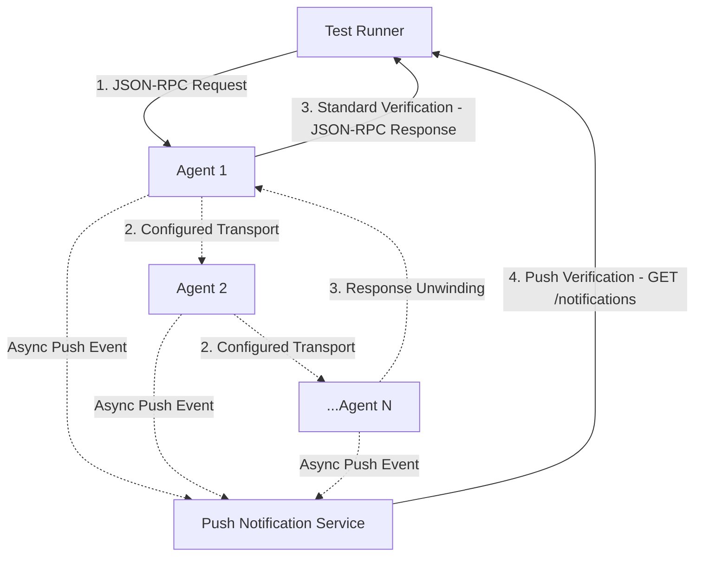

# 🛠 ITK: Integration Test Kit


ITK is a technical toolkit designed to verify compatibility across different A2A SDK implementations and versions. It uses a multi-hop traversal model to ensure that messages can be routed across a cluster of agents using varied transport protocols (JSON-RPC, gRPC, and HTTP-JSON/REST), including support for streaming.

---

## 🏗 Architecture

The kit operates by dispatching a single, deeply nested instruction through a chain of agents, structuring the traversal as a complete verification cycle.

### Traversal Cycle Flow
1. **Dispatch**: The Test Runner initiates execution by sending the nested traversal instruction to the primary entrypoint agent (**Agent 1**) via **JSON-RPC**.
2. **Consistent Inter-Agent Traversal**: For intermediate hops between agents within a given scenario, messaging evaluates a single, consistent transport protocol. Each receiving agent resolves the next target's agent card, maps the transport, and forwards the remaining payload.
3. **Cycle Completion & Trace Verification**: Upon completing the final traversal hop, the execution unwinds, and **Agent 1** returns a JSON-RPC response to the Test Runner across all modes.
   - **Standard / Streaming Verification**: The Test Runner verifies the traversal trace directly from the returned response payload.
   - **Push Notification Verification**: In scenarios evaluating asynchronous event delivery (`push_notification`), participating agents asynchronously push trace updates to an isolated Mock Notification Server during traversal. The Test Runner queries this Push Notification Service (`GET /notifications`) to read and verify the accumulated traversal trace.



---

## 📈 Graph-Based Traversal

To achieve comprehensive verification, ITK utilizes graph-based traversal algorithms:

- **Eulerian Circuits**: Implements **Hierholzer's Algorithm** to generate a single linear nested instruction chain that covers 100% of directed edges in the agent cluster exactly once.
- **Dynamic Topology**: Supports complete digraphs (n-to-n) or custom edge definitions to test specific connection patterns.

---

## 🌟 Key Features

### 🤖 SDK-Agnostic Test Runner
- **Universal Independence**: Operates completely independently of any underlying A2A SDK version or language implementation.

### 🔌 Extensible SDK Support & CI/CD Integration
ITK is structured to validate in-development SDK codebases against a cluster of reference stable configurations, basing on released versions of A2A SDKs. It is serving as a verification gate for **Pull Requests** and automated **nightly runs**.

- **Stable Reference Baselines**: Pre-packaged reference implementations for released A2A versions.
- **Current Agent Mounting**: Dynamically mounts a local SDK source checkout into a designated "current" agent process to evaluate compatibility against the stable cluster.

#### SDK Support Matrix

| SDK Language | Stable v0.3 | Stable v1.0 | Current Mount Support |
| :--- | :---: | :---: | :---: |
| **Python** | ✅ | ✅ | ✅ |
| **Go** | ✅ | ✅ | ✅ |
| **TypeScript** | ❌ | ❌ | ✅ |
| **Java** | ❌ | ✅ | ⚠️ |
| **Rust** | ❌ | ✅ | ❌ |
| **.NET** | ❌ | ❌ | ⚠️ |

> [!NOTE]
> ⚠️ *Indicates preliminary integration layout utilizing initial placeholders for current SDK state *

### 🛤 Multi-Protocol & Interaction Modes
Executes standalone traversal scenarios dedicated to verifying compatibility across each primary transport protocol:
- **JSON-RPC**
- **gRPC**
- **HTTP-JSON (REST)**

Within these transport scenarios, the following A2A features can be tested:
- **Send Message**: Standard request-response messaging.
- **Send Message (Streaming)**: Streaming message payloads across compatible transport protocols.
- **Push Notification**: Asynchronous event delivery and ingestion verification.
- **Task Resubscription**: Initiates a streaming communication lifecycle where the client extracts the active task ID, disconnects, re-subscribes to resume the stream, and finally issues a cancellation request (`cancel_task`) to terminate the task.

---

## 📂 Project Structure

- `agents/`: SDK-specific agent implementations (e.g., Go, Python).
- `dashboard/`: Static web assets (HTML, JS, CSS) for rendering compatibility matrix test results.
- `scripts/`: Auxiliary utilities, including result-parsing metrics pipelines.
- `test_suite/`: Modular agent definitions, launchers, and traversal logic.
- `itk_service.py`: FastAPI orchestration service for remote test execution.
- `notifications_app.py`: Dedicated mock server for ingesting and verifying SDK push notifications.
- `run_tests.py`: CLI orchestrator for running concurrent test scenarios.
- `testlib.py`: Core logic for cluster lifecycle, port management, and test execution.
- `Dockerfile`: Container environment definition for the ITK service.

---

## 🚀 Usage

### Prerequisites
- **uv**: Python package and project manager.
- **Go 1.25+**: Required for Go agent builds.
- **Node.js v20**: Required for certain A2A utility components.

### 1. Local Run with Stable SDKs
Run the standard integration suite locally using purely the stable reference baseline agents:
```bash
uv run run_tests.py
```

### 2. Setting up PR Testing & Nightly Runs
To gate **Pull Requests** or schedule automated **nightly runs** against an in-development SDK repository (e.g., `a2a-python` or `a2a-go`), consuming codebases mount their local source directly into ITK's validation container runtime.

#### Integration Requirements

1. **Instruction Handling Agent Implementation**:
   - Consuming SDKs must implement an instruction handling agent capable of parsing nested traversal instructions and executing varied agent behavior modes.
   - **Implementation Reference**: The native stable baselines hosted in this repository ([agents/go](https://github.com/a2aproject/a2a-itk/tree/main/agents/go) and [agents/python](https://github.com/a2aproject/a2a-itk/tree/main/agents/python)) serve as comprehensive production referrals for custom handling logic.

2. **Custom Scenario Definitions**:
   - Consuming repositories supply customized scenario suites tuned to the desired depth of testing:
     - **PR Testing (`scenarios.json`)**: Shorter, optimized validation paths focused on rapid compatibility verification.
     - **Nightly Runs (`scenario_full.json`)**: Comprehensive, multi-hop matrix configurations evaluating edge-case behavior and transport stability across protocol matrix boundaries.
   - **Scenario Schema & Fields**: Configuration files define a root object containing a `tests` array. Each scenario object specifies:
     - `name` *(String, Required)*: Descriptive display title for the test scenario.
     - `sdks` *(Array of Strings, Required)*: Target agent identifiers participating in the cluster (e.g., `["current", "python_v10", "go_v03"]`). The array index dictates node IDs for routing.
     - `protocols` *(Array of Strings, Required)*: Transport mechanisms executed under this topology (`"jsonrpc"`, `"grpc"`, `"http_json"`).
     - `behavior` *(String, Required)*: Verification interaction mode (`"send_message"`, `"push_notification"`, `"resubscribe"`).
     - `edges` *(Array of Strings, Optional)*: Custom directed communication edge pairs using zero-based SDK indices (e.g., `["0->1", "1->0"]`). If omitted, defaults to a complete digraph (n-to-n) topology.
     - `streaming` *(Boolean, Optional)*: If set to `true`, activates streaming message payload delivery. Defaults to `false`.
     - `build_subtests` *(Boolean, Optional)*: If set to `true`, instructs the test runner to extract and execute targeted sub-graphs or individual edges as distinct validation subtests. Defaults to `false`.

3. **Automated Orchestration Wrapper**:
   - The target codebase maintains a runner script (e.g., `run_itk.sh`) that exports `A2A_ITK_REVISION`, clones the test suite, compiles the core test container, dynamically mounts the workspace source as the `current` agent context, and verifies execution outputs.

#### Consuming SDK References
Review production integration structures, runner scripts, and CI workflow templates directly in the main remote repositories:

- **Python SDK (`a2a-python`)**:
  - **Integration Setup**: Core integration layout and runner configurations ([itk/](https://github.com/a2aproject/a2a-python/tree/main/itk)).
  - **PR Validation Workflow**: Continuous integration gating for Pull Requests ([itk.yaml](https://github.com/a2aproject/a2a-python/blob/main/.github/workflows/itk.yaml)).
  - **Nightly Run Workflow**: Automated scheduled test matrix verification ([nightly.yaml](https://github.com/a2aproject/a2a-python/blob/main/.github/workflows/nightly.yaml)).

- **Go SDK (`a2a-go`)**:
  - **Integration Setup**: Core integration layout and runner configurations ([itk/](https://github.com/a2aproject/a2a-go/tree/main/itk)).
  - **PR Validation Workflow**: Continuous integration gating for Pull Requests ([itk.yaml](https://github.com/a2aproject/a2a-go/blob/main/.github/workflows/itk.yaml)).
  - **Nightly Run Workflow**: Automated scheduled test matrix verification ([itk-nightly.yaml](https://github.com/a2aproject/a2a-go/blob/main/.github/workflows/itk-nightly.yaml)).

---

## 📊 Centralized Dashboard

ITK hosts a static centralized visualization dashboard to aggregate and display recurring nightly integration test matrix results.

- **Public Dashboard URL**: [A2A ITK Dashboard](https://a2aproject.github.io/a2a-itk/dashboard)

### Daily Snapshot Processing

> [!NOTE]
> The centralized dashboard does **not** provide real-time live monitoring. It functions as a daily integration status update reflecting completed overnight matrix executions.

The data presentation pipeline operates via a decoupled publication model:
1. **Metrics Artifact Generation**: Consuming SDK repositories execute comprehensive multi-protocol traversal suites overnight. Upon completion, extracted run results are formatted as structured JSON metrics artifacts.
2. **Rolling Release Ingestion**: Consuming repositories push these extracted JSON artifacts directly to a specially dedicated rolling release tag named **`nightly-metrics`** inside their own GitHub releases environment.
3. **Aggregated Deployment**: A scheduled daily workflow within the `a2a-itk` repository fetches these static released metrics from each target SDK's `nightly-metrics` tag and triggers a static site compilation, re-deploying the unified frontend to GitHub Pages.

### Onboarding a New SDK to the Dashboard

When integrating automated nightly matrix runs for a newly onboarded language library, follow these steps to render its compatibility outputs globally:

1. Ensure the new SDK's nightly continuous integration workflow publishes its final output JSON artifacts to a rolling release tag named `nightly-metrics`.
2. Modify the automated dashboard deployment workflow within this repository ([.github/workflows/deploy_dashboard.yaml](https://github.com/a2aproject/a2a-itk/blob/main/.github/workflows/deploy_dashboard.yaml)) to fetch the metric payload from the new target SDK's release space alongside existing baseline configurations.

---

## 📋 Task Backlog

To further expand verification depth and ensure absolute compliance with the growing Agent2Agent protocol standard, future iterations aim to address the following roadmap items:

### 1. Erroneous Behavior & Fault Tolerance Verification
- [ ] **Error Assertion Mapping**: Verify that SDK implementations raise structurally correct exceptions under anomalous execution paths.
- [ ] **Out-of-Order Processing**: Assert failures when attempting to enqueue task status updates prior to task state creation.
- [ ] **Terminal State Handshakes**: Validate graceful rejections when initiating subscriptions against explicitly completed or failed task instances.

### 2. Protocol Specification & Schema Validation
- [ ] **Agent Card Passing Suites**: Establish targeted automated subtests focused exclusively on resolving, exchanging, and validating `AgentCard` payload structures.
- [ ] **Payload Content Boundaries**: Expand schema adherence gates ensuring message envelopes strictly align with explicit protocol schema definitions.

### 3. Expanded A2A API Capability Coverage
Incorporate traversal test strategies evaluating additional native client API contracts present in standard baseline models:
- [ ] `get_task` / `list_tasks`
- [ ] `create_task_push_notification_config` / `delete_task_push_notification_config`
- [ ] `get_extended_agent_card`

### 4. Missing Stable Baseline Implementations
Package stable agents images for:
- [ ] **TypeScript** baseline agents
- [ ] **.NET** baseline agents
- [ ] **Java** baseline agents
- [ ] **Rust** baseline agents

### 5. Client SDK Repository Orchestration
Integrate full continuous integration orchestration pipelines and custom instruction handlers across client SDK repositories to transition them from placeholders to active validation status:
- [ ] **TypeScript SDK**: Configure automated scheduled **nightly runs** pipeline publishing validation JSON payloads to dashboard `nightly-metrics` releases.
- [ ] **Java SDK**: Implement functional instruction handling agents and scenario orchestration scripts to replace existing basic `current` placeholders.
- [ ] **.NET SDK**: Implement functional instruction handling agents and scenario orchestration scripts to replace existing basic `current` placeholders.
- [ ] **Rust SDK**: Set up core mounting configuration, custom handlers, and full repository verification workflows.

### 6. Automated Baseline Lifecycle
- [ ] **Stable Agent Version Bumping**: Implement automated CI/CD workflows to periodically detect new stable upstream A2A SDK releases and automatically bump version configurations for ITK reference baseline agents.
