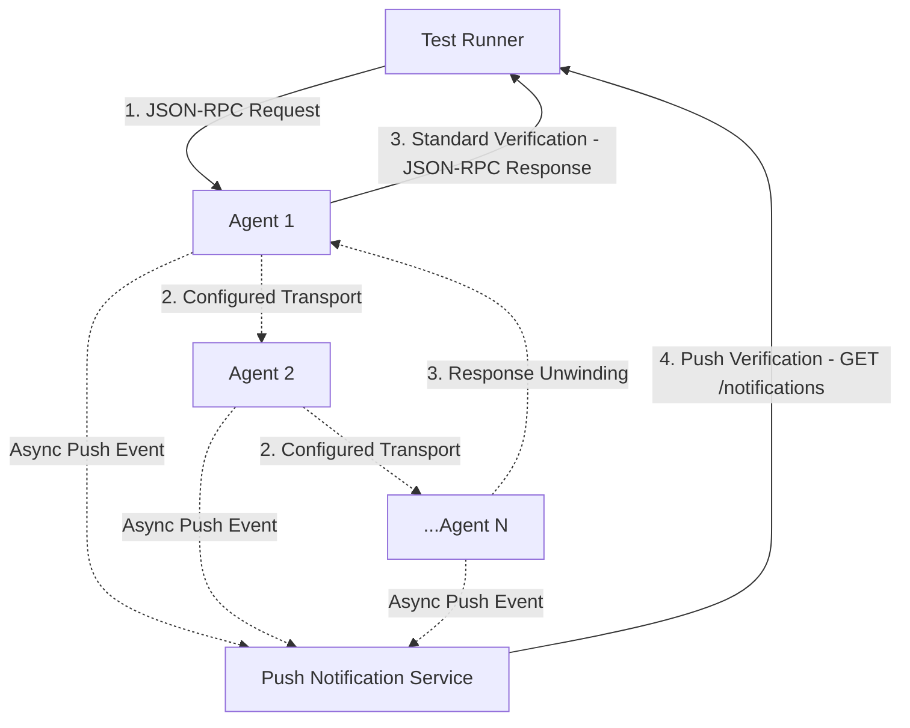

# 🛠 ITK: Integration Test Kit


ITK is a technical toolkit designed to verify compatibility across different A2A SDK implementations and versions. It uses a multi-hop traversal model to ensure that messages can be routed across a cluster of agents using varied transport protocols (JSON-RPC, gRPC, and HTTP-JSON/REST), including support for streaming.

---

## 🏗 Architecture

The kit operates by dispatching a single, deeply nested instruction through a chain of agents, structuring the traversal as a complete verification cycle.

### Traversal Cycle Flow
1. **Dispatch**: The Test Runner initiates execution by sending the nested traversal instruction to the primary entrypoint agent (**Agent 1**) via **JSON-RPC**.
2. **Consistent Inter-Agent Traversal**: For intermediate hops between agents within a given scenario, messaging evaluates a single, consistent transport protocol. Each receiving agent resolves the next target's agent card, maps the transport, and forwards the remaining payload.
3. **Cycle Completion & Trace Verification**: Upon completing the final traversal hop, the execution unwinds, and **Agent 1** returns a JSON-RPC response to the Test Runner across all modes.
   - **Standard / Streaming Verification**: The Test Runner verifies the traversal trace directly from the returned response payload.
   - **Push Notification Verification**: In scenarios evaluating asynchronous event delivery (`push_notification`), participating agents asynchronously push trace updates to an isolated Mock Notification Server during traversal. The Test Runner queries this Push Notification Service (`GET /notifications`) to read and verify the accumulated traversal trace.


```mermaid
graph TD
    Runner[Test Runner] -->|1. JSON-RPC Request| Ag1[Agent 1]
    Ag1 -.->|2. Configured Transport| Ag2[Agent 2]
    Ag2 -.->|2. Configured Transport| AgN[...Agent N]
    
    %% Return Path (Always Executed)
    AgN -.->|3. Response Unwinding| Ag1
    Ag1 -->|3. Standard Verification - JSON-RPC Response| Runner
    
    %% Push Notification Path & Verification
    PNS[Push Notification Service]
    Ag1 -.->|Async Push Event| PNS
    Ag2 -.->|Async Push Event| PNS
    AgN -.->|Async Push Event| PNS
    PNS -->|4. Push Verification - GET /notifications| Runner
```

---

## 📈 Graph-Based Traversal

To achieve comprehensive verification, ITK utilizes graph-based traversal algorithms:

- **Eulerian Circuits**: Implements **Hierholzer's Algorithm** to generate a single linear nested instruction chain that covers 100% of directed edges in the agent cluster exactly once.
- **Dynamic Topology**: Supports complete digraphs (n-to-n) or custom edge definitions to test specific connection patterns.

---

## 🌟 Key Features

### 🤖 SDK-Agnostic Test Runner
- **Universal Independence**: Operates completely independently of any underlying A2A SDK version or language implementation.

### 🔌 Extensible SDK Support & CI/CD Integration
ITK is structured to validate in-development SDK codebases against a cluster of reference stable configurations, basing on released versions of A2A SDKs. It is serving as a verification gate for **Pull Requests** and automated **nightly runs**.

- **Stable Reference Baselines**: Pre-packaged reference implementations for released A2A versions.
- **Current Agent Mounting**: Dynamically mounts a local SDK source checkout into a designated "current" agent process to evaluate compatibility against the stable cluster.

#### SDK Support Matrix

| SDK Language | Stable v0.3 | Stable v1.0 | Current Mount Support |
| :--- | :---: | :---: | :---: |
| **Python** | ✅ | ✅ | ✅ |
| **Go** | ✅ | ✅ | ✅ |
| **TypeScript** | ✅ | ✅ | ✅ |
| **Java** | ❌ | ✅ | ✅ |
| **Rust** | ❌ | ✅ | ✅ |
| **.NET** | ❌ | ❌ | ⚠️ |

> [!NOTE]
> ⚠️ *Indicates preliminary integration layout utilizing initial placeholders for current SDK state *

### 🛤 Multi-Protocol & Interaction Modes
Executes standalone traversal scenarios dedicated to verifying compatibility across each primary transport protocol:
- **JSON-RPC**
- **gRPC**
- **HTTP-JSON (REST)**

Within these transport scenarios, the following A2A features can be tested:
- **Send Message**: Standard request-response messaging.
- **Send Message (Streaming)**: Streaming message payloads across compatible transport protocols.
- **Push Notification**: Asynchronous event delivery and ingestion verification.
- **Task Resubscription**: Initiates a streaming communication lifecycle where the client extracts the active task ID, disconnects, re-subscribes to resume the stream, and finally issues a cancellation request (`cancel_task`) to terminate the task.

---

## 📂 Project Structure

- `protos/instruction.proto`: The single source for the traversal instruction message. Every SDK's agent generates its stubs from this file.
- `pyproto/`: Python stubs generated from `protos/instruction.proto` (committed; regenerate with `./build_protos.sh`).
- `matrix.yaml`: Maps each scenario-level agent identifier (`python_v10`, `go_v03`, …) to the SDK repo and ref the launcher fetches it from.
- `test_suite/launcher/`: The launcher engine — fetch, cache, build, spawn, health-check, and tear down a cluster of agents at given repo+SHA.
- `test_suite/`: Agent identifier registry and the Eulerian traversal logic that turns a scenario into a nested instruction.
- `scenarios/smoke.json`: Default scenario set for `run_tests.py` — peers only, so it runs with no SDK checked out.
- `dashboard/`: Static web assets (HTML, JS, CSS) for rendering compatibility matrix test results.
- `scripts/`: Auxiliary utilities, including result-parsing metrics pipelines.
- `itk_runner.py`: The scenario execution pipeline — plan, start a cluster, run, tear down. Shared by both front ends below.
- `itk_service_v2.py`: HTTP `/run` handler, for CI. A thin wrapper over `itk_runner`.
- `run_tests.py`: Local CLI, for running scenarios on your own machine. Also a thin wrapper over `itk_runner`.
- `notifications_app.py`: Dedicated mock server for ingesting and verifying SDK push notifications.
- `testlib.py`: Scenario execution — payload construction, transport dispatch, and result verification.
- `Dockerfile`: Container environment definition for the ITK service.

---

## 🚀 Usage

### Prerequisites
- **uv**: Python package and project manager.
- **Go 1.25+**: Required for Go agent builds.
- **Node.js v20**: Required for certain A2A utility components.

### 1. Local Run
Every peer is fetched from its own repository at the ref pinned in [`matrix.yaml`](matrix.yaml), so
a scenario that doesn't reference `current` needs nothing checked out but this repo:

```bash
uv run run_tests.py                              # the bundled smoke set
uv run run_tests.py --scenarios path/to/x.json   # any SDK's scenarios.json
uv run run_tests.py --sdks python_v10,go_v10     # narrow to those peers
uv run run_tests.py --list-sdks                  # what matrix.yaml can resolve
uv run run_tests.py --dry-run                    # plan only, no network
```

To test a local SDK checkout as the code under test, point `current` at it — the `run_itk.sh`
workflow without the container round-trip:

```bash
uv run run_tests.py --mount ~/Source/a2a-python/itk \
                    --scenarios ~/Source/a2a-python/itk/scenarios.json
```

`run_tests.py` and the HTTP `/run` handler share one pipeline ([`itk_runner.py`](itk_runner.py)), so
a scenario behaves the same locally and in CI.

Two things to know. Builds run on your machine with each SDK's native toolchain, so you need
whatever the selected peers require (uv, go + `protoc-gen-go`, cargo, mvn + JDK, npm) — the bundled
smoke set sticks to python and go for that reason. And builds are cached under `$ITK_CACHE_DIR`
(default `~/.cache/a2a-itk`), so a cold first run is slow and repeats are fast. Add `--log-dir DIR`
to capture each agent's output when something won't start.

If you'd rather not install a toolchain, the same CLI runs inside the ITK image, which has all of
them:

```bash
docker build -t itk_service .
docker run --rm -v "$PWD/scenarios:/scenarios" \
  -v "$HOME/.cache/a2a-itk-launcher:/root/.cache/a2a-itk" \
  itk_service uv run run_tests.py --scenarios /scenarios/smoke.json
```

The unit tests cover the launcher and traversal logic with no network at all: `uv run pytest`.

### 2. Setting up PR Testing & Nightly Runs
To gate **Pull Requests** or schedule automated **nightly runs** against an in-development SDK repository (e.g., `a2a-python` or `a2a-go`), consuming codebases mount their local source directly into ITK's validation container runtime.

#### Integration Requirements

1. **Instruction Handling Agent Implementation**:
   - Consuming SDKs must implement an instruction handling agent capable of parsing nested traversal instructions and executing varied agent behavior modes.
   - The agent lives in the SDK's own repository under `itk/`, and generates its proto stubs from this repo's `protos/instruction.proto`. Add the SDK to [`matrix.yaml`](matrix.yaml) so the launcher knows which repo and ref to fetch it from.
   - **Implementation Reference**: [a2a-python/itk](https://github.com/a2aproject/a2a-python/tree/main/itk) and [a2a-go/itk](https://github.com/a2aproject/a2a-go/tree/main/itk) are the reference implementations.

2. **Custom Scenario Definitions**:
   - Consuming repositories supply customized scenario suites tuned to the desired depth of testing:
     - **PR Testing (`scenarios.json`)**: Shorter, optimized validation paths focused on rapid compatibility verification.
     - **Nightly Runs (`scenario_full.json`)**: Comprehensive, multi-hop matrix configurations evaluating edge-case behavior and transport stability across protocol matrix boundaries.
   - **Scenario Schema & Fields**: Configuration files define a root object containing a `tests` array. Each scenario object specifies:
     - `name` *(String, Required)*: Descriptive display title for the test scenario.
     - `sdks` *(Array of Strings, Required)*: Target agent identifiers participating in the cluster (e.g., `["current", "python_v10", "go_v03"]`). The array index dictates node IDs for routing.
     - `protocols` *(Array of Strings, Required)*: Transport mechanisms executed under this topology (`"jsonrpc"`, `"grpc"`, `"http_json"`).
     - `behavior` *(String, Required)*: Verification interaction mode (`"send_message"`, `"push_notification"`, `"resubscribe"`).
     - `edges` *(Array of Strings, Optional)*: Custom directed communication edge pairs using zero-based SDK indices (e.g., `["0->1", "1->0"]`). If omitted, defaults to a complete digraph (n-to-n) topology.
     - `streaming` *(Boolean, Optional)*: If set to `true`, activates streaming message payload delivery. Defaults to `false`.
     - `build_subtests` *(Boolean, Optional)*: If set to `true`, instructs the test runner to extract and execute targeted sub-graphs or individual edges as distinct validation subtests. Defaults to `false`.

3. **Automated Orchestration Wrapper**:
   - The target codebase maintains a runner script (e.g., `run_itk.sh`) that exports `A2A_ITK_REVISION`, clones the test suite, compiles the core test container, dynamically mounts the workspace source as the `current` agent context, and verifies execution outputs.

#### Consuming SDK References
Review production integration structures, runner scripts, and CI workflow templates directly in the main remote repositories:

- **Python SDK (`a2a-python`)**:
  - **Integration Setup**: Core integration layout and runner configurations ([itk/](https://github.com/a2aproject/a2a-python/tree/main/itk)).
  - **PR Validation Workflow**: Continuous integration gating for Pull Requests ([itk.yaml](https://github.com/a2aproject/a2a-python/blob/main/.github/workflows/itk.yaml)).
  - **Nightly Run Workflow**: Automated scheduled test matrix verification ([nightly.yaml](https://github.com/a2aproject/a2a-python/blob/main/.github/workflows/nightly.yaml)).

- **Go SDK (`a2a-go`)**:
  - **Integration Setup**: Core integration layout and runner configurations ([itk/](https://github.com/a2aproject/a2a-go/tree/main/itk)).
  - **PR Validation Workflow**: Continuous integration gating for Pull Requests ([itk.yaml](https://github.com/a2aproject/a2a-go/blob/main/.github/workflows/itk.yaml)).
  - **Nightly Run Workflow**: Automated scheduled test matrix verification ([itk-nightly.yaml](https://github.com/a2aproject/a2a-go/blob/main/.github/workflows/itk-nightly.yaml)).

---

## 📊 Centralized Dashboard

ITK hosts a static centralized visualization dashboard to aggregate and display recurring nightly integration test matrix results.

- **Public Dashboard URL**: [A2A ITK Dashboard](https://a2aproject.github.io/a2a-itk/dashboard)

### Daily Snapshot Processing

> [!NOTE]
> The centralized dashboard does **not** provide real-time live monitoring. It functions as a daily integration status update reflecting completed overnight matrix executions.

The data presentation pipeline operates via a decoupled publication model:
1. **Metrics Artifact Generation**: Consuming SDK repositories execute comprehensive multi-protocol traversal suites overnight. Upon completion, extracted run results are formatted as structured JSON metrics artifacts.
2. **Rolling Release Ingestion**: Consuming repositories push these extracted JSON artifacts directly to a specially dedicated rolling release tag named **`nightly-metrics`** inside their own GitHub releases environment.
3. **Aggregated Deployment**: A scheduled daily workflow within the `a2a-itk` repository fetches these static released metrics from each target SDK's `nightly-metrics` tag and triggers a static site compilation, re-deploying the unified frontend to GitHub Pages.

### Onboarding a New SDK to the Dashboard

When integrating automated nightly matrix runs for a newly onboarded language library, follow these steps to render its compatibility outputs globally:

1. Ensure the new SDK's nightly continuous integration workflow publishes its final output JSON artifacts to a rolling release tag named `nightly-metrics`.
2. Modify the automated dashboard deployment workflow within this repository ([.github/workflows/deploy_dashboard.yaml](https://github.com/a2aproject/a2a-itk/blob/main/.github/workflows/deploy_dashboard.yaml)) to fetch the metric payload from the new target SDK's release space alongside existing baseline configurations.

---

## 📋 Task Backlog

To further expand verification depth and ensure absolute compliance with the growing Agent2Agent protocol standard, future iterations aim to address the following roadmap items:

### 1. Erroneous Behavior & Fault Tolerance Verification
- [ ] **Error Assertion Mapping**: Verify that SDK implementations raise structurally correct exceptions under anomalous execution paths.
- [ ] **Out-of-Order Processing**: Assert failures when attempting to enqueue task status updates prior to task state creation.
- [ ] **Terminal State Handshakes**: Validate graceful rejections when initiating subscriptions against explicitly completed or failed task instances.

### 2. Protocol Specification & Schema Validation
- [ ] **Agent Card Passing Suites**: Establish targeted automated subtests focused exclusively on resolving, exchanging, and validating `AgentCard` payload structures.
- [ ] **Payload Content Boundaries**: Expand schema adherence gates ensuring message envelopes strictly align with explicit protocol schema definitions.

### 3. Expanded A2A API Capability Coverage
Incorporate traversal test strategies evaluating additional native client API contracts present in standard baseline models:
- [ ] `get_task` / `list_tasks`
- [ ] `create_task_push_notification_config` / `delete_task_push_notification_config`
- [ ] `get_extended_agent_card`

### 4. Client SDK Repository Onboarding
- [ ] **.NET SDK**: Implement an instruction handling agent under `itk/`, add a `matrix.yaml` entry, and wire up the orchestration workflow.
