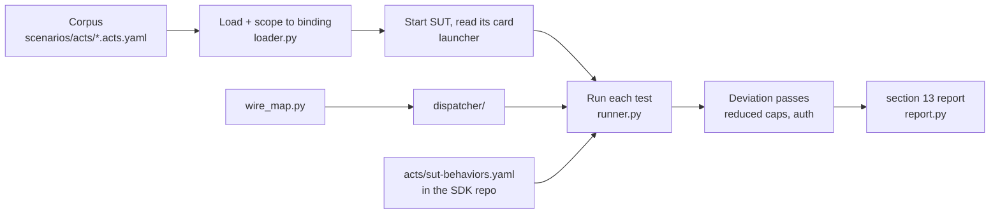

# ACTS architecture

How a YAML test becomes wire calls and a verdict. The runner lives in [`test_suite/acts/`](../../test_suite/acts/); the pipeline that starts the SUT around it is [`acts_runner.py`](../../acts_runner.py). As with ITK, two front ends ([`run_acts.py`](../.uv run run_acts.py) and `POST /run-acts` in [`itk_service_v2.py`](../../itk_service_v2.py)) share that one pipeline.



ACTS is kept apart from the traversal suite on purpose. They share the launcher and the agents, nothing else: a traversal starts N agents and walks a circuit between them, a conformance run starts one and interrogates it.

## The pipeline

`acts_runner.run(transport, ...)` does the following for one binding.

1. **Load the corpus.** `loader.load_suite` reads the manifest (`suite.acts.yaml`), follows its `include:` list, validates every file against the schema exactly as written - nothing is rewritten on the way in - and flattens the result into one ordered list of tests, each tagged with the suite it came from. Duplicate test ids across files are an error here, because they would overwrite each other in the report.
2. **Scope to the binding.** Tests that declare `transport:` for a different binding are dropped, not skipped. A report covers one binding, and a test that cannot apply to it should not appear in the denominator - gRPC is scored out of 88, not out of 111 with 23 phantom skips. `-t` subsets are applied just before this.
3. **Read the behavior contract.** `acts/sut-behaviors.yaml` from the SDK repository root (the parent of the mounted `itk/`). Present: the set of `tck-*` prefixes the SDK claims. Absent: gating is off, with a warning.
4. **Start the SUT** through the same `Cluster` the traversal suite uses, as a single `MOUNT` target. The agent is started with `--httpPort` and `--grpcPort` and is up when its card answers.
5. **Read the card** at `/.well-known/agent-card.json`, with `A2A-Version: 1.0`. The header matters: the spec makes an absent header mean 0.3, and an SDK with a compatibility layer would answer with its 0.3 card, on which capabilities are spelled differently. Redirects are not followed; the card decides what the whole run tests, so an agent that serves it somewhere else should fail loudly.
6. **Build the dispatcher** for the binding. The URL comes from the card's `supportedInterfaces`, preferring the entry with `protocolVersion: 1.0` (the ITK agents also publish a 0.3 interface at the same URL for traversal compatibility). A JSON-RPC agent may mount at `/jsonrpc/`, a REST one at `/rest/`; the card is the only reliable source. The dispatcher adds `Authorization: Bearer itk-valid-token` to every abstract operation (see [Authentication](#authentication) below).
7. **Start the webhook receiver**: `notifications_app.py` on a free port, the same mock the traversal suite uses for push notifications. If it comes up, the runner is granted the `webhook_endpoint` requirement and the `webhookUrl` variable; if not, tests needing it skip rather than losing the run.
8. **Run every test in order** (`Runner.run_suite`). Sequential, because the SUT's task list is global to it and `list_tasks` assertions only mean something if nothing else is creating tasks at the same time.
9. **Deviation passes.** Some tests were skipped because the default SUT advertised a capability the test needs absent, or declared no authentication when the test needs some. For each such group a second SUT is started with an environment variable asking it to behave differently, those tests alone are re-run, and their verdicts are spliced in.
10. **Build the report** (`report.build`), a section 13 document.

Each binding is a separate call, with a separate SUT; `run_acts.py` loops over the bindings you asked for and the CI driver sends one request per binding.

## From an abstract step to a wire call

A step says `operation: get_task` with `params: {id: ...}`. Nothing in the corpus names an HTTP method, a path, a gRPC RPC or a JSON-RPC method, which is what lets one corpus run on three bindings.

[`wire_map.py`](../../test_suite/acts/wire_map.py) is the one table that maps abstract names to wire facts, in both directions:

| Abstract | JSON-RPC | REST | gRPC |
| --- | --- | --- | --- |
| `send_message` | method `SendMessage` | `POST /message:send` | `SendMessage` |
| `get_task` | method `GetTask` | `GET /tasks/{id}` | `GetTask` |
| `TaskNotFoundError` | code `-32001` | status 404, `ErrorInfo.reason` | `NOT_FOUND` + reason |

The tables follow the A2A specification's own method and error mapping (sections 5.3 and 5.4) rather than the copies in the ACTS spec, because the ACTS spec says the A2A spec wins where they disagree and the copies have drifted. Divergences are noted inline in the file.

[`dispatcher/`](../../test_suite/acts/dispatcher/) has one adapter per binding. All three return the same `WireResponse`: status, headers, payload and, on failure, a `WireError` that has already been normalised - error type, message, the JSON-RPC code or gRPC status that carried it, and the details list whichever key the binding used. The runner never looks at the transport.

The transports are driven at a low level - `httpx` for the two HTTP bindings, generated stubs over `grpc.aio` for gRPC - not through an A2A client library. A conformance suite asserts on exactly the things a client is built to hide: the status code, the headers, whether the body was valid JSON at all. Several tests also send payloads a well-behaved client would refuse to construct.

**Raw steps** (`raw: {method, path, body, headers}`) bypass the mapping and send an HTTP request as written. They exist for the binding-specific tests (`JSONRPC-*`, `REST-*`), are refused on gRPC, and carry **no** default headers - which is what makes an unauthenticated probe actually unauthenticated.

## Deciding what happened

[`runner.py`](../../test_suite/acts/runner.py) sequences one test: gate it, run its steps, evaluate assertions. Four outcomes, and the distinctions between them carry most of the design.

| Outcome | Means | Counts against conformance |
| --- | --- | --- |
| `pass` | Every step and assertion held | - |
| `fail` | The SUT answered, and its answer did not conform | yes, at `must` level |
| `skip` | The test does not apply to this SUT or this runner | no |
| `error` | The run could not complete the step: connection refused, a variable nobody defined, a raw step on gRPC | yes - but it is a statement about the harness, and is counted separately so a broken runner is not read as a non-conformant SDK |

A SUT answering in a shape the binding does not permit - for example a streaming response with the wrong `Content-Type`, so it cannot be read as SSE - is a `fail`, not an `error`: that is a finding about the SUT.

### Gating: why a test is skipped

Checked in this order, before any step runs:

1. **Binding.** A backstop - the pipeline already scoped the corpus.
2. **Step kinds.** The one kind the runner does not execute is a bare `assertion` step; the corpus contains none.
3. **Runner requirements.** A test may declare it needs `header_inspection`, `auth_credentials`, `concurrent_streams`, `stream_disconnect` or `webhook_endpoint` (section 12.1). This runner has the first four by construction and the fifth whenever the receiver started.
4. **Preconditions** (section 12.5), evaluated against the agent card:
   - `capabilities: {streaming: true}` - the card must advertise it (a card that omits a capability has not advertised it). A capability name that A2A does not define at all is reported as `PRECONDITION CANNOT BE SATISFIED`, a distinct skip that `run_acts.py` lists separately, because no SUT could ever clear it and it would otherwise look like "not applicable here".
   - `authentication: true` - the card must declare both `securitySchemes` and a non-empty `securityRequirements`. Schemes alone are an offer, not a requirement.
   - `skills`, `transport`, `extensions` - presence checks.

### Behaviors: a failure, not a skip

After gating, a test's `requires_behaviors` is compared with the SDK's contract. A prefix the SUT does not declare **fails** the test. A skip would let an SDK's missing support disappear quietly from its own conformance report, which is the opposite of what the report is for. `--no-gate` turns this off; then the test runs and almost certainly fails on its assertions instead.

### Steps

Each test gets a fresh variable `Scope` (section 3.2, isolation), seeded with the document's `variables` and the runner's. Steps run in order; the first one that does not pass ends the test, because later steps read this one's captures and would only produce a cascade describing the same cause.

| Step kind | What the runner does |
| --- | --- |
| operation, unary | Substitute `{{...}}` in `params`, dispatch, evaluate `expect` (status, headers, body) or `expect_error`, record the response and run `capture` |
| operation, with `repeat` | Re-dispatch until the `until` expression holds or attempts run out (defaults: 10 attempts, 1000 ms, no backoff). Running out is a fail |
| operation, streaming | Read events until the stream closes, `max_count` is reached, or the timeout. Evaluate `expect_stream`: event count, matchers on specific events, the final event, and whether the task states form a legal progression. `streams: N` opens N concurrent streams; `disconnect_after` hangs up mid-stream |
| raw | Send the HTTP request as written, no default headers; evaluate as above |
| `client_response` | section 10: ask the SUT's *own client* to parse a canned payload. No A2A operation does this, so it rides a `send_message` whose text is `tck-client-parse` and whose data part carries `{operation, wire_payload}`; the agent answers with what its client parsed and `expect_parsed` is evaluated like a body |
| `expect_webhook` | Poll the receiver for notifications delivered to `webhookUrl` for a task until `min_count` arrive or `timeout_ms` passes; evaluate `each_event`, `final_event`, `headers` and `token` |

Every abstract operation carries `A2A-Version: 1.0` (section 12.4); on gRPC it is call metadata.

A streaming step with no `timeout_ms` of its own gets 30 seconds. Not one streaming step in the corpus declares a timeout, and without a backstop a SUT that never closes a stream would hang the run and produce no report at all.

### Assertions

[`assertions.py`](../../test_suite/acts/assertions.py) implements section 5. An `expect.body` is a tree that mirrors the response: a scalar leaf is an exact match, a map is either a descent into a field or a set of operators on the value - and the syntax does not say which. `{status: {state: X}}` is two field descents; `{type: array, count_gte: 1}` is two operators. The rule the evaluator applies: **a key is an operator when it is a known operator name and its argument is well-formed for that operator; otherwise it is a field name.** Both halves are needed - the corpus asserts on RFC 9457 bodies whose members really are called `type` and `title`.

Operators: `type`, `exists`, `absent`, `contains`, `matches`, `starts_with`, `ends_with`, `gt`/`gte`/`lt`/`lte`, `count`/`count_gte`/`count_lte`, `one_of`, and `items` for per-element assertions on an array. Named assertions on a collection use `any`/`all`/`none` with a path and a matcher.

Failures record the assertion path (`task.status.state`), the expected and actual values, and the step, so a report entry can be acted on without re-running.

## Deviations

Four tests assert that an agent **lacking** a capability answers `UnsupportedOperationError`; five assert that an agent **requiring** a credential rejects a request without one. Their preconditions are the opposite of what the rest of the corpus needs, and no single agent can be both. Rather than leave those branches of the protocol untested by anyone, the pipeline starts a second agent that meets them.

| Deviation | Env var set in the SUT's environment | Re-runs tests skipped as | Checks on the second card |
| --- | --- | --- | --- |
| reduced capabilities | `ITK_ACTS_REDUCED_CAPABILITIES=1` | `agent card capability X=True, needs False` | `streaming`, `pushNotifications`, `extendedAgentCard` no longer advertised |
| authentication | `ITK_ACTS_AUTH=1` | `agent card authentication=False, needs True` | `securitySchemes` and `securityRequirements` present |

The selection is keyed on the **skip reason**, not on a list of test ids: the corpus is authored upstream, and a hard-coded list would silently stop matching when a test is renamed, whereas a derived selector leaves an uncleared skip visible in the report.

If the SUT does not honour the variable - the card still advertises streaming, or still declares no security scheme - the original skips stand and a warning says why. A SUT that fails to start in a deviated mode is also a warning, not the loss of the binding's report. Verdicts obtained from a deviated SUT are stamped with `configuration: <env var>` in the report (section 12.8), because a result from a differently configured instance is not interchangeable with one from the agent the rest of the run tested.

The two run serially: the variable is set in the pipeline's own environment, which the launcher passes to the child, so two SUTs alive at once could not be told apart.

## Authentication

The ACTS spec says a runner needs `auth_credentials` for some tests but never says what the credential is. The pairing is this repository's convention:

| Token | Presented by | Expected answer |
| --- | --- | --- |
| `itk-valid-token` | Every abstract operation, as `Authorization: Bearer` | Authenticated and authorised. Needed for `get_extended_agent_card`, which the spec puts behind authentication |
| `itk-insufficient-token` | Raw steps that reference `{{insufficientAuthToken}}` | Authenticated but not authorised: 403, not 401 |
| nothing | Raw steps that set no header | 401 where a credential is required |

Raw steps never carry the default header; that is why the abstract and raw step kinds must not share one header set, and the whole reason the `SEC-EXTCARD-*` probes mean anything.

The runner also supplies `otherUserTaskId` (a fixed UUID the SUT has never issued) for the tests that ask for a task belonging to someone else.

## The report

`report.build` produces the section 13.1 document, which is frozen the way ITK's `/run` response is - dashboards read it, and fields are only added:

```json
{
  "acts_version": "1.0",
  "spec_version": "1.0",
  "generated_at": "2026-10-06T02:14:09Z",
  "sdk": {"name": "a2a-python", "version": "...", "language": "python", "repository": "..."},
  "transport": "jsonrpc",
  "environment": {"runner": "a2a-itk", "python": "3.12....", "platform": "..."},
  "summary": {
    "total": 101, "passed": 96, "failed": 2, "skipped": 3, "errors": 0, "duration_ms": 48213,
    "by_level": {
      "must":   {"total": 59, "passed": 56, "failed": 1, "skipped": 2, "errors": 0},
      "should": {"...": "..."},
      "may":    {"...": "..."}
    }
  },
  "suites": [
    {"id": "core-operations", "name": "Core A2A operations", "tests": [
      {"id": "CORE-SEND-001", "name": "...", "level": "must", "result": "pass", "duration_ms": 412,
       "steps": [{"id": "send", "result": "pass", "duration_ms": 410}]},
      {"id": "CORE-HIST-003", "level": "must", "result": "fail", "duration_ms": 1203,
       "failure": {"message": "...", "step_id": "get", "expected": "4", "actual": "3",
                   "assertion_path": "history.length"}},
      {"id": "CORE-CAP-001", "level": "must", "result": "pass",
       "configuration": "ITK_ACTS_REDUCED_CAPABILITIES", "...": "..."}
    ]}
  ]
}
```

`is_conformant(report)` is section 12.7: `summary.by_level.must.failed == 0` and `summary.by_level.must.errors == 0`. Skips do not count either way.

The file name follows section 13.5: `acts-report-<sdk>-<transport>-<timestamp>.json`. `run_acts.py --out` and the CI driver both write it.
