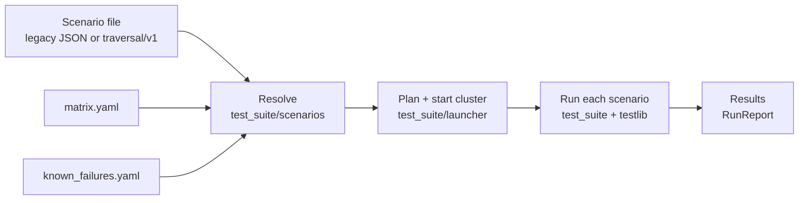

# ITK architecture

This page explains what happens between "here is a scenario file" and "here is a pass/fail per scenario". It is organised the way the code is: a pipeline with four stages, each owned by one module.



Two front ends drive this pipeline and own no logic of their own: [`run_tests.py`](../../run_tests.py) (the local CLI) and [`itk_service_v2.py`](../../itk_service_v2.py) (the `POST /run` handler CI uses). Both call [`itk_runner.py`](../../itk_runner.py). This is deliberate - "the local runner and CI disagree" is the bug the shared pipeline exists to rule out.

## Stage 1: resolve scenarios

Input: a `{"tests": [...]}` document. Each entry is either a legacy scenario (names concrete agents and hand-written edges) or a `traversal/v1` scenario (names roles and a topology). The two can be mixed in one file.

Output: a flat list of `ResolvedScenario` objects, all in the legacy shape - `name`, `sdks`, `edges`, `protocols`, `behavior`, `streaming`, `tier`. Nothing downstream knows which format a scenario came from.

For `traversal/v1` entries the resolver ([`test_suite/scenarios/resolver.py`](../../test_suite/scenarios/resolver.py)):

1. Expands roles to agent identifiers. `peers: all` reads every line out of `matrix.yaml`; `include_own_lines` adds the SUT's own released lines; `expand: per_peer` splits one declaration into one scenario per peer.
2. Expands plural fields - `transports`, `behaviors`, `streaming_variants` - into a Cartesian product. Each transport becomes its own scenario so a failure names the transport that broke.
3. Drops a peer from any transport it cannot speak, per the line's `transports` ceiling in `matrix.yaml`.
4. Applies `known_failures.yaml`. A matching exclusion removes the named peer from the graph if at least two agents remain; otherwise the scenario is skipped. Every removal and skip is logged with its reason.
5. Turns `topology` into an edge list. Index 0 is always the SUT.

Everything skipped or trimmed at this stage is reported as a warning. The rule throughout ITK is that a run must never go green while quietly testing less than its file says.

Details of both formats and all fields are in [03_scenarios.md](03_scenarios.md).

## Stage 2: plan and start the cluster

Input: the resolved scenarios. Output: a running cluster and an `AgentTable` mapping each agent identifier to the ports it listens on.

### Planning

`itk_runner._plan` takes the union of every agent identifier any scenario names, so each agent is started exactly once for the whole batch, and turns each into a `TargetSpec`:

- `current` -> `Kind.MOUNT`. Served from `$ITK_MOUNT_DIR`, which is `/app/agents/repo/itk` in the container or whatever `--mount` points at.
- anything else -> `Kind.CHECKOUT`. `matrix.yaml` gives the repo and ref; the ref is resolved to a 40-character SHA with `git ls-remote` right here, once per unique (repo, ref). A moving branch therefore cannot change under a run and mix versions between two peers that share an entry.

An identifier with a `_2`, `_3`... suffix (`python_v10_2`) is a second, independently ported instance of the same source, for scenarios that need two agents of the same SDK.

### The launcher

[`test_suite/launcher/`](../../test_suite/launcher/) does the rest, through the `Cluster` context manager:

| Step | Module | What happens |
| --- | --- | --- |
| fetch | `fetch.py`, `cache.py` | Clone exactly one commit into `cache/trees/<key>/`. Transient git errors are retried; a missing SHA is a permanent error |
| codegen | `codegen.py` | Generate the agent's stubs from `protos/instruction.proto` the way that SDK's `run_itk.sh` does: `grpc_tools.protoc` for Python, `protoc` for Go, `buf generate` for TypeScript, a symlink for Rust and Java (their builds read the proto themselves), nothing for .NET |
| build | `builders.py` | Run the SDK's native build (`uv sync --locked`, `go build`, `npm ci`, `mvn -Pitk install`, `cargo build --release`, `dotnet publish`). A `.itk-built` sentinel marks the tree reusable |
| spawn | `current.py` | Detect the language from the directory contents and start the agent with `--httpPort N --grpcPort M`, in its own process group |
| readiness | `health.py` | Poll `http://127.0.0.1:N/.well-known/agent-card.json` until it returns 200, up to `ITK_READINESS_TIMEOUT` |
| teardown | `cluster.py` | SIGTERM then SIGKILL the whole process group, close logs, release cache pins, return ports |

Ports come from the OS ephemeral range (`ports.py`), so two runs on one host do not collide. Fetch, build and spawn run in parallel across peers, capped by `ITK_MAX_WORKERS`.

The cache key is `slug(repo)@sha@image_digest@proto_digest`. Per-key file locks make a concurrent build and a concurrent eviction of the same tree safe, and per-run pin files stop a tree from being evicted while a run holds it.

### Partial failure

`Cluster.start_all` returns an outcome per agent rather than raising. The runner then decides:

- The SUT did not start -> `ClusterStartupError`. There is nothing to test.
- A peer did not start -> it is dropped. Scenarios that can lose it (a star with one arm gone is still a star) run on the survivors; scenarios that cannot (explicit edges, or fewer than two agents left) are skipped. Both lists travel back on the `RunReport` so the lost coverage is visible in the CLI output and in the `/run` response.
- Every scenario needed a peer that did not start -> `ClusterStartupError` again, rather than an empty green run.

## Stage 3: run a scenario

Input: one resolved scenario and the `AgentTable`. Output: pass or fail. Scenarios run sequentially; the agents are shared and running traversals concurrently against them overloads the slower ones.

### Building the instruction

[`test_suite/__init__.py`](../../test_suite/__init__.py) turns the scenario's graph into one nested protobuf message, an `Instruction` as defined in [`protos/instruction.proto`](../../protos/instruction.proto):

```
Instruction = CallAgent | ReturnResponse | SeriesOfSteps
CallAgent      { transport, agent_card_uri, instruction, streaming, behavior }
ReturnResponse { response, hold_task }
SeriesOfSteps  { instructions[], response_generator = CONCAT }
```

For each transport in the scenario:

1. Find an Euler circuit over the scenario's edges - a walk that uses every directed edge exactly once and returns to the start. Hierholzer's algorithm does this; a plain DFS would skip edges that lead back to visited nodes. The graph must be balanced (in-degree equals out-degree at every node) or the scenario is rejected with a `ValueError`. Named topologies are balanced by construction.
2. Walk the circuit backwards, wrapping each hop around the one after it. Hop `u -> v` becomes a `SeriesOfSteps` with two children: a `ReturnResponse` carrying the trace token `[u -> v (transport)]`, and a `CallAgent` telling `u` to fetch `v`'s agent card at `agent_card_uri`, call it over `transport`, and hand it the remaining instruction. The innermost instruction is a `ReturnResponse` with `traversal-completed:<transport>`.
3. Record the expected tokens - every trace token plus the terminal one.

If the scenario lists several transports, one circuit per transport is built and all of them are concatenated into a single top-level `SeriesOfSteps`. This is why the shared sets split transports into separate scenarios: a bundled scenario fails as a whole and its name does not say which transport broke.

A disconnected edge list (two separate cycles) yields several circuits, each traversed in turn.

### Sending it

[`testlib.py`](../../testlib.py) serialises the instruction, base64-encodes it, and puts it in a file part of a `SendMessage` (or `SendStreamingMessage`) JSON-RPC request to the **first** agent in the scenario's `sdks` list, at `<card_uri>/jsonrpc`. ITK itself only ever speaks JSON-RPC to the entry agent; the transport under test is what the agents use between themselves.

The request dialect is chosen from the first agent's identifier: an id containing `v03` gets an A2A 0.3 request (`message/send`, `kind: file`, `A2A-Version: 0.3`); anything else gets A2A 1.0 (`SendMessage`, `raw`/ `mediaType`, `A2A-Version: 1.0`). Putting a `v03` peer first is how a scenario tests the "0.3 client calling 1.0 server" direction.

### Behaviors

| Behavior | What each hop does | How the result is read |
| --- | --- | --- |
| `send_message` | Calls the next agent and returns its reply concatenated with its own trace token | The final JSON-RPC result (or the joined SSE stream when `streaming: true`) must contain every expected token |
| `push_notification` | Same, but every agent also registers a push notification config pointing at ITK's mock receiver and pushes its status updates there | ITK starts [`notifications_app.py`](../../notifications_app.py) on a free port for the scenario, then reads `GET /notifications` and checks both the final text and that every intermediate state was pushed - proof that each hop pushed, not just the last one |
| `resubscribe` | Streaming only. The caller starts a stream, reads the task id, disconnects, resubscribes to the task, then cancels it. `hold_task` keeps every task in `WORKING` so there is something to resubscribe to | Same token check as `send_message` on the aggregated stream |

Streaming reads use SSE and stop as soon as every expected token has been seen, so a stream the agent keeps open after completing does not stall the run. The HTTP read timeout is 120 s, but an SSE keep-alive resets it, so on its own it cannot end a hop that is stuck. Each traversal (a scenario, or one subtest) therefore also runs under a deadline, `ITK_SCENARIO_TIMEOUT` (60 s by default): when it expires the scenario is logged as `did not finish within Ns (ITK_SCENARIO_TIMEOUT)`, recorded as failed, and the run moves on to the next one.

### Subtests

A legacy scenario with `build_subtests: true` is expanded into every induced subgraph that contains the first agent, has at least two nodes and is still balanced, and each subgraph is run as its own named result (`<name>-sub-<agents>`). This is how a large graph can tell you which pair broke. The shared sets do not use it; `expand: per_peer` covers the same need at resolution time.

## Stage 4: results

`run_scenarios` returns a `RunReport`:

- `results`: scenario name -> `ScenarioResult(passed, sdks, edges, protocols, behavior, streaming, tier)`. `sdks` and `edges` come from what actually ran, which can be smaller than the file says when a peer was trimmed.
- `dropped_peers`, `trimmed`, `skipped`: what a failed peer cost.

The service renders this as the `/run` response; the CLI prints a table and can write the same JSON with `--output`. Downstream, `scripts/itk_report.py` validates the shape and `scripts/process_results.py` appends a nightly entry to the SDK's rolling history - see [04_ci.md](04_ci.md).

## The ITK agent, from the other side

Every SDK ships an agent under `itk/` in its own repository. It is an ordinary A2A server built with that SDK, plus one skill: when a message arrives whose first part is a serialised `Instruction`, execute it. That means:

- `ReturnResponse`: reply with the given text; if `hold_task`, leave the task in `WORKING` instead of completing it.
- `CallAgent`: fetch the agent card at `agent_card_uri`, pick the interface for `transport`, build a client, send the nested instruction on with the requested behavior and streaming flag, and return what comes back.
- `SeriesOfSteps`: run the children in order and concatenate their replies.

The agent is therefore both the server under test (when a peer calls it) and the client under test (when it calls the next peer). What exactly it has to provide is listed in [05_sdk-integration.md](05_sdk-integration.md).

## Serialisation and isolation

- One run holds an `asyncio.Lock` in `itk_runner` for its whole duration. A second `/run` request waits. Runs own host ports, cache pins and the notification server, and two at once would fight over all three.
- `AgentTable` is passed down the call chain, never stored in a global, so ports from one run cannot leak into the next.
- The matrix is loaded lazily on the first run, so a malformed `matrix.yaml` fails the run rather than preventing the service from starting (which keeps `/health` useful for debugging).
